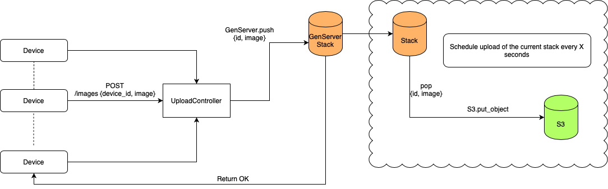

# ImageUploader

At a company there are several thousand devices, each taking photos every 30 seconds. 
Photos are used in computer vision processing and analysis by other people in the company. 
To avoid outgoing network saturation, devices upload to a local API server instead of all uploading to S3 at once.
The local API server then further has the ability to queue files locally and upload to S3 at a controlled rate.

### Your task:

Using Elixir, build an API server that accepts image file uploads and throttles the image upload to S3 to achieve optimal performance.
The API should have a single endpoint that receives a multipart request where the payload in the request consists of two parts: device_id and image.
The image value should be the image binary. While the device → API upload is the requirement for this exercise, we'd like you to focus on how you would approach uploading to S3 and the local queueing process to control the outgoing rate.

We're also interested to see how you can leverage automated testing to increase reliability for this feature.

Additionally, feel free to mock out the AWS APIs.
It is not important that you have a working integration with any AWS services.
Some assumptions you may make:
- Local network upload speed is 200mbps. 
- Image file size is an average of 4mb.
- Allocate no more than 50% of bandwidth resources for file uploads at any time.
- Application will receive roughly 1,000 images per minute but can also receive bursts of many more that we'll need to handle.

> You may use any libraries or tools you think are best for the job.
> Please limit this exercise to no more than 4 hours.
> Be prepared to explain your thought process and how you'd expand on the feature set given more time.

### Flow Diagram



### Test
Here is a script to _simulate_ many devices uploading images at the same time

```bash
seq 1 100000 | xargs -n1 -P 150 bash -c "curl --request POST \
    --url http://localhost:4000/image \
    --header 'content-type: multipart/form-data;' \
    --form device_id=device_1 \
    --form image=adsfkjasdfaskjfsadjf"
```

> Now the application saves the images into the file system under /tmp
> with a delay of 2 seconds in every save to simulate the upload to S3
> [~4mb image at ~2mb/s speed => ~2s time]

### Improvements
  * In this approach the device don't know if the image was succesfully saved.
  The cliente may provide a service to communicate if an image was succesfully saved or not, so when the actual save is done (maybe with retries) the application call this service telling the device the actual result

  * Here we have only one process running (almost) all the time, taking an image and saving it in S3. Ideally, have a pool of workers running in parallel for this purpose

### Start
To start your Phoenix server:

  * Install dependencies with `mix deps.get`
  * Create and migrate your database with `mix ecto.setup`
  * Start Phoenix endpoint with `mix phx.server`